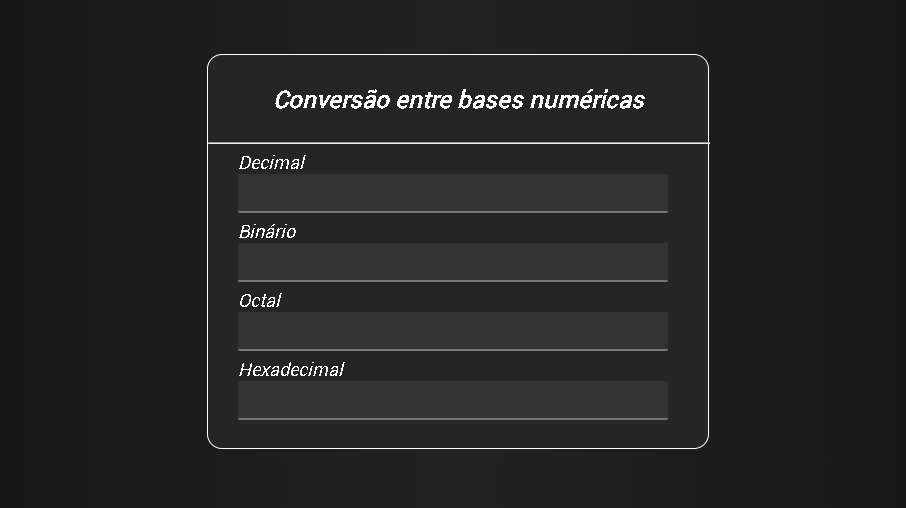

    

# Conversão de base numérica

Conversão de base numérica é a passagem da representação de um número de uma base numérica para outra. A base que normalmente usamos é a decimal ou base dez, pois contém dez algarismos (0, 1, 2, 3, 4, 5, 6, 7, 8, 9). Por exemplo, o número inteiro representado em base decimal como '10', pode ser escrito como '1010' em base binária ou 'A' em base hexadecimal.
